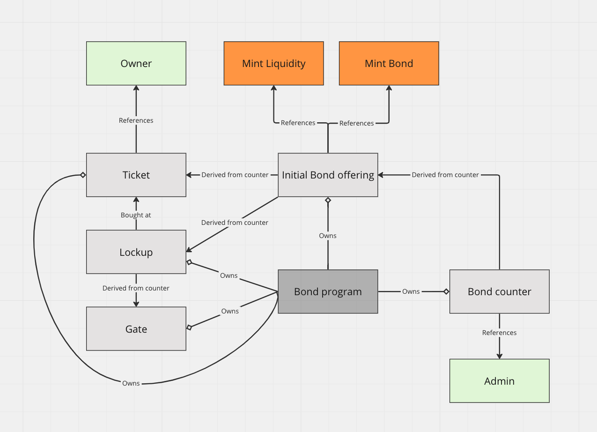

# Bonds

This protocol (BondFort), is a decentralized finance (DeFi) platform built on the Solana blockchain network, which allows participants to engage in the issuance, trading, and management of tokenized bonds. The platform works by allowing an entity, (referred to as the bond master), to issue bonds. Each bond represents a promise to pay a certain amount (the face value) at a future date (maturity date). 

For each bond, the bond master can set different lock-up types. Each of these lock-up types would have their own unique set of parameters:

- Lock-up period: This is the length of time during which the bond must be held before it can be fully redeemed. This period could range from a few months to several years. During this time, the bondholder can't redeem the bond for its full value, although they might be able to sell it to another investor.

- APY: The Annual Percentage Yield represents the rate of return that bondholders can expect over a one-year period, taking into account the effect of compounding. The bond master can set different APYs for different lock-up types, offering higher returns for longer lock-up periods as an incentive for investors to hold the bond for a longer time.

The bond master can also introduce additional restrictions or features for each lock-up type:

- NFT community restrictions: The bond master can restrict certain lock-up types to be exclusive to specific NFT communities. 

- Maturity-only claims: In some cases, the bond master might set up a lock-up type where the returns can only be claimed when the bond reaches maturity. This would mean that the bondholders have to hold the bond for the entire lock-up period to get their returns. This could be used to encourage long-term holding and stabilize the price of the bond.

These bonds are tokenized, meaning each bond is represented by a unique record entry for this specic bond offering. This fractionalisation allows for the easy and secure transfer of ownership of these bonds.

Once issued, these bonds are available for purchase by the users. A user purchases a bond by paying in the underlying token specified by the bond master. The purchased bond earns interest over time, which is paid out to the bondholder. The interest can be withdrawn by the bondholder as it accrues, which provides an income stream for the bondholder. Though interest is calculated based on compounding APY, this is done once at the start, after that locked tokens are released linearly.

Additionally, users can sell their bonds to other users. This is facilitated by a secondary market function within the platform, where bonds can be listed for sale. The seller can set the sale price, and potential buyers can browse the listed bonds and purchase ones they are interested in. When a bond is sold, the sale price is divided among various parties. The seller receives the majority of the sale price. However, a portion of the sale price is taken as a cut by the bond master. This cut is further divided between the bond master and the master master.

Each bond offering also includes lockups. These prevent bond master from draining the bond PDA of underlying token or introducing lockups that favour them over those that have already pruchsed some bonds.

## State architecture

## Testing

Run metaplex enabled validator with:

    solana-test-validator --bpf-program metaqbxxUerdq28cj1RbAWkYQm3ybzjb6a8bt518x1s metaplex_token_metadata_program.so --reset

Then  you need to:
1. `anchor build`
2. `anchor deploy`
3. `anchor run test`

## TODOs:

### Clean-up

[x] change lockup to lockup  
[x] change ticket to bond  
[ ] Remove `msg!`  
[X] In the diagram change:  
    - Bond counter to Bond offering counter  
    - Ticket to Bond  
[ ] Remove any fucking american spelling

### Functionality

[x] Implement withdraw for liquidity tokens stored at ibo PDA  
[x] Need to withdraw of leftover bond tokens past some hardcoded date  
[x] Ability to remove lockups and gates before it is locked  
[ ] Reuse functionality for NFTs:   
    NFTs owned by the ibo account.   
    Above NFT purchase specific tokens released linearly to the given bond for a user.  
    Bond tokens can be used to claim NFT at a set price level.  
    Or they can be resold. On purchase they are burned, and two step invocation for a VRF is made.  
    Based on that a random NFT is selected and can be withdrawn. Would need a wheel to iterate over all of the remaining NFTs using the obtained randomness.  
[ ] Option for a price look-up. Rather than having a fixed price, instead need a call to an oracle to fetch   latest price and use that

### Revenue

[x] Take a cut from bond issuance to us   
    - When user buys underlying, they get exact conversion but reuser gets slight cut in liquidity that they receive  
[x] Take a cut from bond resale to us and ibo deployer    
    - When user buys a swap, seller is charged a small cut from what they receive  
[x] Take some SOL for splitting bond/bond    
[x] SOL fee for spinning up an IBO  

### Safety

[x] createIBO needs to take some sort of pubkey which represents the desired bond token to purchase    
[x] Correct ATA and ata mint/owner provided as the master recipient   

### Optimisation

[ ] Make accounts as small as possible to save costs    
[ ] Inputs to functions can be smaller (as for percent input)    
[ ] Before deployment hardcode program ID    
[ ] I think `mint_key` in `buy_bond_gated()` and in setting up that gate is redundant    

### Testing

[ ] Multiple files and/or `describe()` so that deployment can happen once, but can skip doing same thing or a reptetive set-up    
[x] Test kept invocation counter incremented at the end of a function   
[ ] Tests for removing rate and gate  
[x] Test for taking cut to us on bond purchase   
