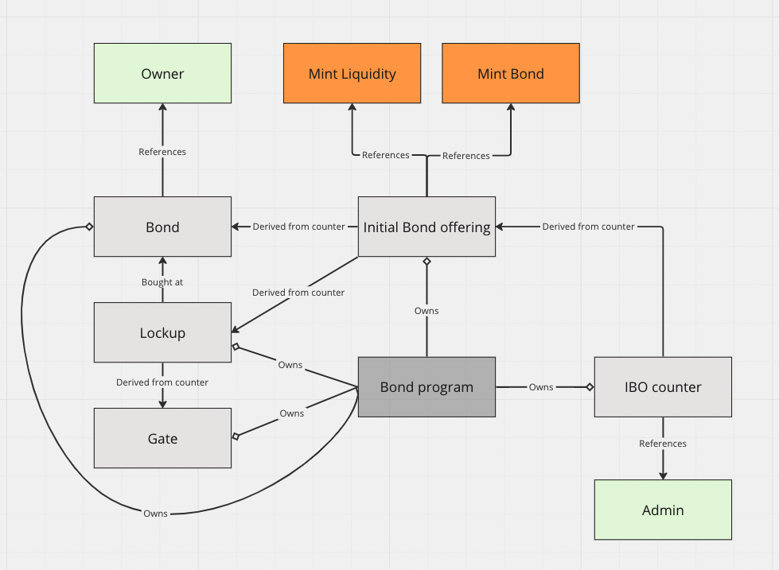

# Bonds

## State architecture

## Testing

Run metaplex enabled validator with:

    solana-test-validator --bpf-program metaqbxxUerdq28cj1RbAWkYQm3ybzjb6a8bt518x1s metaplex_token_metadata_program.so --reset

Then  you need to:
1. `anchor build`
2. `anchor deploy`
3. `anchor run test`

## TODOs:

### Clean-up

[x] change lockup to lockup  
[x] change ticket to bond
[ ] Remove `msg!`  
[ ] In the diageam change:
    - Bond counter to Bond offering counter
    - Ticket to Bond

### Functionality

[x] Implement withdraw for liquidity tokens stored at ibo PDA  
[x] Need to withdraw of leftover bond tokens past some hardcoded date  
[x] Ability to remove lockups and gates before it is locked  
[ ] Reuse functionality for NFTs:   
    NFTs owned by the ibo account.   
    Above NFT purchase specific tokens released linearly to the given bond for a user.  
    Bond tokens can be used to claim NFT at a set price level.  
    Or they can be resold. On purchase they are burned, and two step invocation for a VRF is made.  
    Based on that a random NFT is selected and can be withdrawn. Would need a wheel to iterate over all of the remaining NFTs using the obtained randomness.  
[ ] Option for a price look-up. Rather than having a fixed price, instead need a call to an oracle to fetch   latest price and use that

### Revenue

[ ] Take a cut from bond issuance to us 
    - When user buys underlying, they get exact conversion but reuser gets slight cut in liquidity that they receive
[ ] Take a cut from bond resale to us and ibo deployer  
    - When user buys a swap, seller is charged a small cut from what they receive
[ ] Take some SOL for splitting bond/bond  
[ ] SOL fee for spinning up an IBO

### Safety

[ ] createIBO needs to take some sort of pubkey which represents the desired bond token to purchase  

### Optimisation

[ ] Make accounts as small as possible to save costs  
[ ] Inputs to functions can be smaller (as for percent input)  
[ ] Before deployment hardcode program ID  
[ ] I think `mint_key` in `buy_bond_gated()` and in setting up that gate is redundant  

### Testing

[ ] Multiple files and/or `describe()` so that deployment can happen once, but can skip doing same thing or a reptetive set-up  
[x] Test kept invocation counter incremented at the end of a function
[ ] Tests for removing rate and gate
